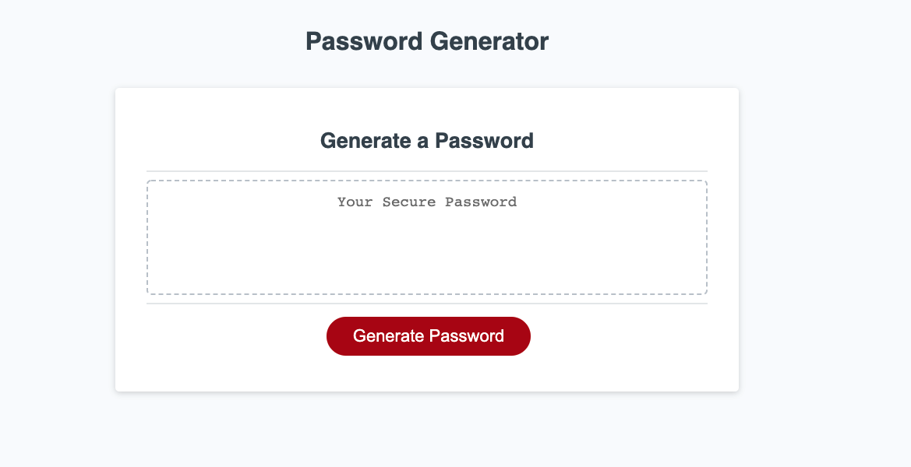

# PasswordGenerator
Link: https://edgaro93.github.io/PasswordGenerator/

## Description

This Password Generator was built using JavaScript. The generator works by randomly selecting from a combination array made up of each criteria array after each user chooses one. I was able to learn about some new methods such as the Array.prototype.push.apply to combine arrays. I also tried some other methods such as splitting strings into arrays or applying functions to arrays that I ended up not using in my final code. I think I got more comfortable with if/else statements and loop statements. For future updates, I could try adding like a copy paste option.

## Screenshot

## Acknowlegments
~~~
I would like to thank my tutor as well online resources such as W3 schools, MDN Web Docs, and Stack Overflow.
~~~